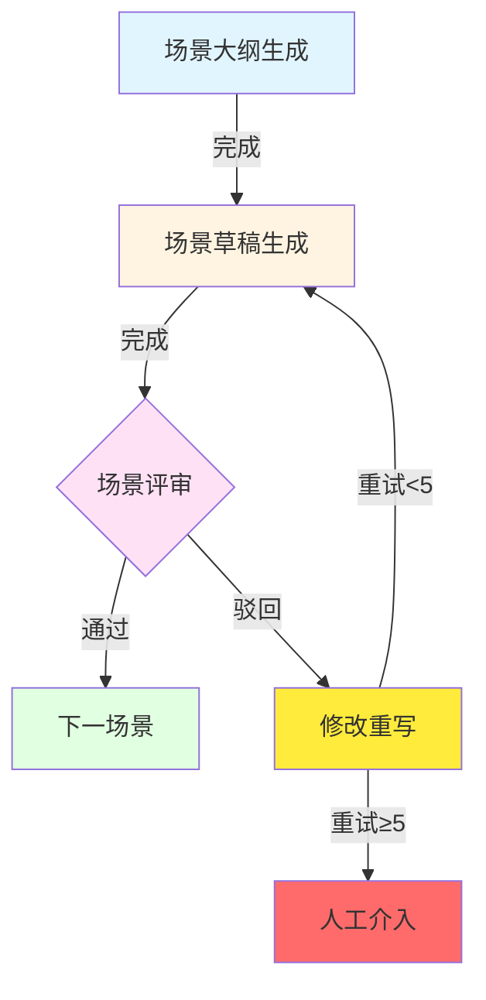

# AutoNovel-Studio 开发规划文档

**版本**: v2.1
**日期**: 2026-03-14
**状态**: 已批准（经架构评审修正）

---

## 📋 变更日志

### v2.1 (2026-03-14) - 架构评审修正版
- **[关键修正]** 智能重试决策权从Author转移至Editor
- **[关键修正]** 新增级联失效机制（Cascade Invalidation）
- **[关键修正]** 新增文件锁与并发安全方案
- **[新增]** 文本差异对比功能（difflib）
- **[优化]** Gradio使用生成器模式（yield）替代WebSocket
- **[优化]** 调整Phase顺序：书籍管理优先

### v2.0 (2026-03-14) - 初始版本
- 初始版本发布

---

## 📋 目录

1. [项目概述](#项目概述)
2. [新功能需求](#新功能需求)
3. [架构设计](#架构设计)
4. [技术方案](#技术方案)
5. [实现计划](#实现计划)
6. [风险评估](#风险评估)
7. [附录](#附录)

---

## 项目概述

### 当前状态

AutoNovel-Studio v1.0已完成核心功能：
- ✅ GAN架构：Author vs 4×Reader + Editor
- ✅ 物理引擎检测：Logic_Leap, NPC_Behavior, Info_Overload
- ✅ 两层读者系统：场景级（草稿）+ 章节级（正文）
- ✅ 自动场景大纲生成
- ✅ 中文提示词系统

### v2.0目标

升级为**可交互的AI小说创作工作台**，支持：
1. **智能重试机制**：作者自主决定是否参考草稿
2. **人机协作UI**：可选的对话式创作指导
3. **多书籍管理**：完整的项目隔离系统
4. **可视化工作流**：实时展示创作进度和状态
5. **章节重构**：支持选择性重写特定章节

---

## 🚨 架构评审修正（v2.1）

### 修正1: 智能重试机制 - 控制权转移

**原设计问题**：
- 由Author Agent自主决定是否查看前稿
- LLM存在"自傲感（Overconfidence）"，可能做出错误判断
- 增加一次无效的LLM请求和Token消耗

**修正方案**：

```python
class EditorRevisionPlan(BaseModel):
    """Editor修订计划（v2.1修正版）"""
    pass_status: bool
    rejected_feedbacks: List[str]
    revision_instructions: List[str]
    scene_target: str
    priority_fixes: List[str]

    # ✅ 新增：主编决策字段
    provide_previous_draft: bool = Field(
        ...,
        description="主编决策：是否允许Author查看前稿（基于错误严重度）"
    )
    draft_summary_level: str = Field(
        default="none",
        description="提供前稿的详细程度：none|brief|full"
    )
```

**决策逻辑**：

| 错误类型 | Severity | provide_previous_draft | draft_summary_level | 理由 |
|---------|----------|----------------------|-------------------|------|
| Lore_Conflict | 4-5 | false | none | 设定冲突必须盲写，前稿会误导 |
| Logic_Error | 4-5 | false | none | 逻辑断裂需要重构 |
| Physics_Engine_Violation | 5 | false | none | 物理引擎违反必须推翻重来 |
| Dash_Abuse | 4-5 | false | none | 破折号滥用需要重写 |
| Cliche_Phrase | 2-3 | true | brief | 陈词滥调可以基于原稿润色 |
| Redundant_Words | 1-2 | true | brief | 冗余词汇可以微调 |
| Weak_Wording | 1-2 | true | full | 措辞问题可以保留原框架 |

**效益**：
- ✅ 省去一次无效的LLM Tool Call
- ✅ 符合人类编辑部运作模式（主编决定修改策略）
- ✅ 逻辑更清晰：严重错误→盲写，轻微问题→润色

---

### 修正2: 章节重构的级联失效机制

**原设计问题**：
- 重构第3章第2场景（如主角放走反派）
- 第3章第3场景可能写的是"摸反派尸体"
- 导致下游场景失效，但系统未检测

**修正方案**：

#### 2.1 场景依赖图

```python
class SceneDependencyGraph:
    """场景依赖图"""

    def __init__(self):
        self.dependencies = {}  # {(ch, sc): [(ch, sc), ...]}
        self.reverse_deps = {}   # {(ch, sc): [(ch, sc), ...]}

    def mark_outdated(self, chapter_num: int, scene_num: int):
        """标记场景为已过期，并级联标记下游"""
        # 1. 标记当前场景为outdated
        self.set_status(chapter_num, scene_num, "outdated")

        # 2. 找到所有依赖当前场景的下游场景
        downstream = self.reverse_deps.get((chapter_num, scene_num), [])

        # 3. 级联标记
        for (down_ch, down_sc) in downstream:
            if self.get_status(down_ch, down_sc) == "completed":
                self.mark_outdated(down_ch, down_sc)

    def get_outdated_scenes(self) -> List[Tuple[int, int]]:
        """获取所有过期场景列表"""
        return [(ch, sc) for (ch, sc), status in self.get_all_status()
                if status == "outdated"]
```

#### 2.2 摘要重构器

```python
class SummaryRebuilder:
    """摘要重构器"""

    async def rebuild_summaries(
        self,
        book_context: BookContext,
        from_chapter: int,
        from_scene: int
    ):
        """重构从指定场景开始的所有摘要"""

        # 1. 获取受影响的场景列表
        outdated_scenes = self.dependency_graph.get_outdated_scenes()

        # 2. 逐个重新生成摘要
        for (ch, sc) in sorted(outdated_scenes):
            # 重新读取场景内容
            draft = book_context.get_scene_draft(ch, sc)

            # 重新生成摘要
            new_summary = await self.summarizer.summarize(
                draft=draft,
                previous_summaries=book_context.get_previous_summaries(ch, sc)
            )

            # 更新摘要
            book_context.update_scene_summary(ch, sc, new_summary)

        # 3. 重建full_summaries.md
        await self.rebuild_full_summaries(book_context)
```

**依赖关系判定**：

```python
def detect_dependency_impact(old_scene: str, new_scene: str) -> bool:
    """检测重构是否影响下游"""

    # 提取关键事件
    old_events = extract_events(old_scene)  # ["林辰杀死叶流云"]
    new_events = extract_events(new_scene)  # ["林辰放走叶流云"]

    # 关键事件变化 = 需要级联更新
    if old_events != new_events:
        return True

    return False
```

---

### 修正3: 并发安全与状态管理

**原设计问题**：
- book_state.json的并发写入可能导致文件锁死
- 三个Reader Agent并发执行，可能同时更新状态

**修正方案**：

#### 3.1 单例StateManager + 文件锁

```python
import aiofiles
from filelock import FileLock
import asyncio

class StateManager:
    """状态管理器（单例模式 + 文件锁）"""

    _instance = None
    _lock = asyncio.Lock()

    def __new__(cls):
        if cls._instance is None:
            cls._instance = super().__new__(cls)
        return cls._instance

    def __init__(self):
        self._write_lock = asyncio.Lock()  # 写入锁
        self._file_lock = None  # 文件锁

    async def update_state(self, book_id: str, updates: Dict):
        """线程安全的状态更新"""

        # 1. 获取写入锁（串行化所有写入操作）
        async with self._write_lock:
            # 2. 读取当前状态
            state_path = self._get_state_path(book_id)
            async with aiofiles.open(state_path, 'r') as f:
                state = json.loads(await f.read())

            # 3. 更新状态
            state.update(updates)

            # 4. 使用文件锁写入
            with FileLock(state_path, timeout=5):
                async with aiofiles.open(state_path, 'w') as f:
                    await f.write(json.dumps(state, ensure_ascii=False, indent=2))

            logger.debug(f"State updated for {book_id}: {updates}")
```

#### 3.2 异步文件I/O

```python
# 所有文件操作使用aiofiles
import aiofiles

async def save_draft(book_id: str, content: str):
    """异步保存草稿"""
    draft_path = get_draft_path(book_id)

    async with aiofiles.open(draft_path, 'w', encoding='utf-8') as f:
        await f.write(content)

    # 更新状态
    await state_manager.update_state(book_id, {
        "last_modified": datetime.now().isoformat()
    })
```

---

### 修正4: UI体验增强

#### 4.1 文本差异对比

```python
import difflib
from gradio import HTML

def show_draft_diff(old_draft: str, new_draft: str) -> HTML:
    """显示草稿差异"""

    # 生成HTML diff
    differ = difflib.HtmlDiff(wrapcolumn=80)
    diff_html = differ.make_table(
        old_draft.splitlines(keepends=True),
        new_draft.splitlines(keepends=True),
        fromdesc='v2',
        todesc='v3'
    )

    # 样式美化
    styled_html = f"""
    <style>
        .diff_add {{ background-color: #d4edda; }}
        .diff_sub {{ background-color: #f8d7da; }}
        .diff_chg {{ background-color: #fff3cd; }}
    </style>
    {diff_html}
    """

    return HTML(styled_html)
```

#### 4.2 Gradio生成器模式（避免WebSocket）

```python
import gradio as gr

async def generate_pipeline_with_yield(
    scene_id: str,
    ui_mode: bool = False,
    user_intent: str = None
):
    """带进度生成的生成器"""

    # 阶段1: 生成大纲
    yield {
        "progress": gr.Progress(0.1, desc="📝 生成场景大纲..."),
        "status": "大纲生成中",
        "draft": "",
        "reviews": None
    }

    outline = await scene_generator.generate_outline(scene_id)

    # UI模式：询问用户意图
    if ui_mode:
        yield {
            "progress": gr.Progress(0.2, desc="💬 等待用户输入..."),
            "status": "等待用户确认大纲",
            "outline": outline,
            "user_input_box": gr.Textbox(visible=True)
        }
        # 等待用户输入...

    # 阶段2: 生成草稿
    yield {
        "progress": gr.Progress(0.3, desc="✍️ 生成场景草稿..."),
        "status": "草稿生成中",
        "outline": outline
    }

    draft = await scene_generator.generate_draft(outline, user_intent)

    # 阶段3: 场景评审
    yield {
        "progress": gr.Progress(0.7, desc="📊 场景评审中..."),
        "status": "评审中",
        "draft": draft
    }

    reviews = await scene_generator.review_scene(draft)

    # 阶段4: 完成
    yield {
        "progress": gr.Progress(1.0, desc="✅ 完成"),
        "status": "完成",
        "draft": draft,
        "reviews": reviews
    }

# 绑定到按钮
btn_generate.click(
    fn=generate_pipeline_with_yield,
    inputs=scene_selector,
    outputs=[progress_bar, status_text, outline_display, draft_display, review_display]
)
```

---

### 修正5: Phase顺序调整

**调整原因**：
- 书籍数据目录结构是系统运行的物理地基
- 先开发智能重试会导致数据迁移时重写所有代码

**新Phase顺序**：

```
Phase 1: 书籍管理系统（3天）
  - 建立数据目录结构
  - 实现CRUD与状态管理
  - 确保并发安全

Phase 2: 智能重试与盲写增强（2天）
  - Editor决策机制
  - 草稿摘要生成
  - 集成到SceneGenerator

Phase 3: 章节重构与级联更新（3天）
  - 依赖图构建
  - 级联失效检测
  - 摘要重构器

Phase 4: UI层与实时监控（3天）
  - Gradio基础界面
  - 生成器模式进度
  - 文本差异对比

Phase 5: 测试与优化（2天）
  - 端到端测试
  - 性能优化
  - 文档完善
```

---

## 新功能需求

### 1. 智能重试机制（优先级：高）

#### 1.1 增加重试次数

#### 1.1 增加重试次数
- **当前**: max_retries=3
- **目标**: max_retries=5
- **理由**: 给予更多迭代机会，特别是复杂场景

#### 1.2 作者草稿参考工具

**需求描述**：
- Author Agent自主决定是否需要查看之前的草稿
- 通过"工具调用（Tool Use）"实现
- 仅在必要时启用，避免陷入"局部最优"

**工具设计**：

```python
class ViewPreviousDraftTool(BaseModel):
    """工具：让Author决定是否查看前稿"""

    should_view: bool = Field(
        ...,
        description="Author是否需要查看之前的草稿"
    )
    reason: str = Field(
        ...,
        description="为什么需要/不需要查看前稿"
    )

    class Config:
        json_schema_extra = {
            "example": {
                "should_view": False,
                "reason": "Editor的修改指令已经足够明确，可以直接重写"
            }
        }
```

**提示词示例**：

```
## 重写决策

你需要决定是否查看之前的草稿来帮助重写。

### 前稿摘要
- 版本: v2
- 主要问题: 时间线错误（五十年vs四十年）、因果链断裂
- 修改指令: 统一时间线、补充因果链

### 你的决策

1. **不需要查看前稿**的情况：
   - 修改指令非常具体（如"把五十年改为四十年"）
   - 需要大幅重构（查看前稿反而限制思路）
   - 前稿质量问题严重（误导性太强）

2. **需要查看前稿**的情况：
   - 需要保留部分精彩描写
   - 修改指令是"微调"而非"重写"
   - 前稿有可取之处但需要调整

请决策并说明理由：
```

**实现流程**：

```
重写请求
    ↓
调用Author工具: should_view_previous_draft?
    ↓
┌─────────────┬─────────────────┐
│             │                 │
不需要查看    需要查看
│             │                 │
│           读取前稿摘要      │
│             │（非全文，仅摘要）│
│             ↓                 │
│         结合摘要+指令重写     │
│             ↓                 ↓
│         └─────────────┘
             ↓
         生成新草稿
```

---

### 2. 人机协作UI模式（优先级：高）

#### 2.1 核心概念

**UI模式** = 可选的交互式创作指导

```
传统模式（默认）          UI模式（可选）
    │                         │
    ↓                         ↓
自动生成场景         ←→    人类输入创作意图
    │                         │
    ↓                         ↓
自动评审             ←→    人类调整大纲
    │                         │
    ↓                         ↓
自动重写             ←→    人类提供修改建议
```

#### 2.2 实现方案

**方案A：命令行交互（CLI UI）**

```python
# 参数控制
python main.py --ui-mode --book-id "book_001" --chapter 1

# 交互流程
[系统] 正在生成第1章第1场景的大纲...
[系统] 场景大纲已生成：背叛与死亡
[系统] 是否需要调整大纲？(y/n/查看详情):

[用户] 查看详情

[系统]
=== 场景大纲 ===
标题: 背叛与死亡
情节要点:
  1. 林辰在密室准备突破
  2. 叶流云端茶下毒
  3. 问心剑贯穿胸膛
  4. 元婴破碎，死亡
因果逻辑链: ...
情绪弧线: ...

[系统] 是否修改大纲？(y/n):

[用户] y

[用户] 请在情节要点3中增加"林辰试图反击但失败"

[系统] 已更新大纲。继续生成场景...

[系统] 场景草稿已生成（782字）
[系统] 场景评审通过率: 33% (1/3)
[系统] 是否人工干预？(y/n/继续):

[用户] n

[系统] 继续自动迭代...
```

**方案B：Web UI（Gradio/Streamlit）**

```python
# Web界面布局
┌─────────────────────────────────────────┐
│  AutoNovel-Studio v2.0                  │
├─────────────────────────────────────────┤
│                                          │
│  📚 书籍管理                             │
│  ┌─────────────────────────────────┐   │
│  │ [新建书籍] [导入书籍] [删除书籍] │   │
│  └─────────────────────────────────┘   │
│                                          │
│  📖 当前书籍: 《青云宗主》               │
│  ├─ 第1章 ✅ 已完成 (3/3场景)           │
│  ├─ 第2章 🔄 生成中 (1/3场景)           │
│  ├─ 第3章 ⏸ 待开始                     │
│  └─ ...                                 │
│                                          │
│  🎬 场景工作台                           │
│  ┌─────────────────────────────────┐   │
│  │ 场景大纲                           │   │
│  │ [编辑大纲] [重新生成]              │   │
│  └─────────────────────────────────┘   │
│  ┌─────────────────────────────────┐   │
│  │ 场景草稿 (v3)                    │   │
│  │ [查看] [编辑] [重写]              │   │
│  └─────────────────────────────────┘   │
│  ┌─────────────────────────────────┐   │
│  │ 评审结果                          │   │
│  │ Pacing: ❌ 物理引擎违反            │   │
│  │ Lore: ❌ 时间线冲突                │   │
│  │ AI Tone: ⚠️ 破折号过多             │   │
│  └─────────────────────────────────┘   │
│                                          │
│  [继续生成] [人工干预] [保存并退出]     │
└─────────────────────────────────────────┘
```

**推荐方案**：**方案B（Web UI）**
- 理由1：可视化更直观
- 理由2：易于展示实时状态
- 理由3：支持远程访问
- 理由4：Gradio/Streamlit成熟易用

#### 2.3 技术选型

**推荐：Gradio**

```python
# 安装
pip install gradio

# 核心代码结构
import gradio as gr

class NovelCreationUI:
    def __init__(self):
        self.generator = SceneGenerator(...)
        self.current_book = None

    def create_ui(self):
        with gr.Blocks() as app:
            # 书籍管理
            with gr.Row():
                book_dropdown = gr.Dropdown(
                    choices=self.list_books(),
                    label="选择书籍"
                )
                btn_new_book = gr.Button("新建书籍")

            # 章节列表
            chapter_list = gr.DataFrame(
                headers=["章节", "状态", "进度"],
                label="章节列表"
            )

            # 场景工作台
            with gr.Tabs():
                with gr.Tab("场景大纲"):
                    outline_display = gr.JSON(label="大纲详情")
                    btn_edit_outline = gr.Button("编辑大纲")

                with gr.Tab("场景草稿"):
                    draft_display = gr.Textbox(
                        lines=20,
                        label="草稿内容"
                    )

                with gr.Tab("评审结果"):
                    review_display = gr.JSON(label="评审详情")

            # 操作按钮
            with gr.Row():
                btn_generate = gr.Button("生成场景")
                btn_human_edit = gr.Button("人工干预")
                btn_save = gr.Button("保存并继续")

        return app
```

---

### 3. 书籍管理系统（优先级：高）

#### 3.1 数据隔离设计

**目录结构**：

```
AutoNovel-Studio/
├── books/                          # 书籍根目录
│   ├── book_001_青云宗主/           # 书籍ID_书名
│   │   ├── 00_Config/
│   │   │   └── book_meta.json      # 书籍配置
│   │   ├── 01_Global_Settings/
│   │   │   ├── world_lore.json     # 世界观设定
│   │   │   └── characters.json     # 角色档案
│   │   ├── 02_Outlines/
│   │   │   ├── volume_01.md        # 卷级大纲
│   │   │   └── chapters/
│   │   │       ├── chapter_01_outline.json
│   │   │       └── ...
│   │   ├── 03_Story_Memory/
│   │   │   ├── full_summaries.md   # 完整摘要
│   │   │   └── recent_chapters/    # 滑动窗口
│   │   ├── 04_Drafts/
│   │   │   ├── ch01/               # 按章组织
│   │   │   │   ├── scene_01_v1.txt
│   │   │   │   ├── scene_01_v2.txt
│   │   │   │   └── ...
│   │   │   └── ...
│   │   ├── 05_Reviews/
│   │   │   ├── ch01/
│   │   │   │   ├── scene_01_reviews.json
│   │   │   │   └── ...
│   │   │   └── ...
│   │   └── book_state.json         # 书籍状态
│   │
│   ├── book_002_重生之赘婿/
│   │   └── ...
│   │
│   └── book_templates/             # 书籍模板
│       ├── xianxia_template.json
│       ├── urban_template.json
│       └── ...
│
├── config/
│   └── library.json                # 图书馆配置（书籍列表）
│
└── logs/
    └── book_001_*.log              # 按书籍隔离的日志
```

#### 3.2 书籍元数据

**book_meta.json**：

```json
{
  "book_id": "book_001",
  "title": "青云宗主",
  "genre": "仙侠",
  "sub_genres": ["重生", "复仇", "黑暗"],
  "tone": "冷酷、压抑、暗黑",
  "forbidden_elements": [
    "禁止圣母行为",
    "禁止降智打击",
    "禁止拖慢节奏的日常流水账"
  ],
  "target_word_count": {
    "chapter": 3000,
    "scene": 800
  },
  "creation_date": "2026-03-14",
  "last_modified": "2026-03-14T18:30:00",
  "status": "in_progress",
  "statistics": {
    "total_chapters": 10,
    "completed_chapters": 1,
    "total_scenes": 30,
    "completed_scenes": 3,
    "total_words": 8527
  }
}
```

**book_state.json**（运行时状态）：

```json
{
  "book_id": "book_001",
  "current_chapter": 1,
  "current_scene": 2,
  "chapter_status": {
    "1": "completed",
    "2": "in_progress",
    "3": "pending"
  },
  "scene_versions": {
    "ch01_scene01": 3,
    "ch01_scene02": 1,
    "ch01_scene03": 0
  },
  "auto_save_enabled": true,
  "last_auto_save": "2026-03-14T18:30:00"
}
```

#### 3.3 书籍管理API

```python
class BookManager:
    """书籍管理器"""

    def __init__(self, library_path: str):
        self.library_path = Path(library_path)
        self.config_path = self.library_path / "config/library.json"
        self.current_book = None

    def list_books(self) -> List[Dict]:
        """列出所有书籍"""
        books = []
        for book_dir in self.library_path.glob("book_*"):
            meta_path = book_dir / "00_Config/book_meta.json"
            if meta_path.exists():
                meta = json.load(meta_path)
                books.append(meta)
        return books

    def create_book(self, book_meta: Dict, template: str = None) -> str:
        """创建新书籍"""
        book_id = f"book_{len(self.list_books()) + 1:03d}"
        book_dir = self.library_path / f"{book_id}_{book_meta['title']}"

        # 创建目录结构
        (book_dir / "00_Config").mkdir(parents=True)
        (book_dir / "01_Global_Settings").mkdir(parents=True)
        (book_dir / "02_Outlines/chapters").mkdir(parents=True)
        (book_dir / "03_Story_Memory/recent_chapters").mkdir(parents=True)
        (book_dir / "04_Drafts").mkdir(parents=True)
        (book_dir / "05_Reviews").mkdir(parents=True)

        # 保存元数据
        book_meta["book_id"] = book_id
        json.dump(book_meta, book_dir / "00_Config/book_meta.json")

        # 应用模板
        if template:
            self._apply_template(book_dir, template)

        return book_id

    def load_book(self, book_id: str) -> BookContext:
        """加载书籍上下文"""
        book_dir = self._find_book_dir(book_id)

        # 加载所有必要文件
        meta = json.load(book_dir / "00_Config/book_meta.json")
        lore = json.load(book_dir / "01_Global_Settings/world_lore.json")
        chars = json.load(book_dir / "01_Global_Settings/characters.json")
        state = json.load(book_dir / "book_state.json")

        self.current_book = BookContext(
            book_id=book_id,
            meta=meta,
            lore=lore,
            chars=chars,
            state=state,
            base_dir=book_dir
        )

        return self.current_book

    def switch_book(self, book_id: str):
        """切换当前书籍"""
        self.current_book = self.load_book(book_id)
        logger.info(f"Switched to book: {self.current_book.meta['title']}")
```

---

### 4. 可视化工作流（优先级：中）

#### 4.1 实时状态展示

**状态面板设计**：

```
┌─────────────────────────────────────────┐
│  📊 创作进度监控                        │
├─────────────────────────────────────────┤
│  当前任务: 生成第1章第2场景             │
│  进度: ████████░░░░░░░░░ 45%            │
│  预计剩余: 2分30秒                      │
├─────────────────────────────────────────┤
│  💡 当前阶段                             │
│  □ 场景大纲生成 ✅ 完成 (0:45)          │
│  □ 场景草稿生成 🔄 进行中...           │
│  ◐ 场景评审 ⏸ 等待中                  │
│  ◐ 编辑决策 ⏸ 等待中                  │
│  ◐ 下一场景 ⏸ 等待中                  │
├─────────────────────────────────────────┤
│  📈 质量指标                             │
│  场景通过率: 33% (1/3)                 │
│  平均评分: 6.3/10                       │
│  主要问题: 物理引擎违反、时间线冲突      │
└─────────────────────────────────────────┘
```

**实时日志流**：

```python
class ProgressTracker:
    """进度跟踪器"""

    def __init__(self):
        self.current_stage = None
        self.stages = [
            "outline_generation",
            "draft_generation",
            "scene_review",
            "editor_decision",
            "next_scene"
        ]

    async def track_progress(self, stage: str, progress: float):
        """跟踪进度并通过WebSocket推送到UI"""
        status = {
            "stage": stage,
            "progress": progress,
            "timestamp": datetime.now().isoformat()
        }

        # 推送到WebSocket
        await self.websocket.send_json(status)

        # 更新进度条
        self.update_progress_bar(progress)
```

#### 4.2 阶段可视化

**使用Mermaid图表展示工作流**：



---

### 5. 章节重构功能（优先级：中）

#### 5.1 需求描述

**用户场景**：
- 作者对第3章第2场景不满意
- 想要重写这个场景
- 但不想重新生成整个章节

**UI交互**：

```
┌─────────────────────────────────────────┐
│  章节列表                               │
├─────────────────────────────────────────┤
│  第1章 ✅ 已完成 (3/3场景)     [重构]   │
│  第2章 ✅ 已完成 (3/3场景)     [重构]   │
│  第3章 🔄 生成中 (2/3场景)              │
│  │   ├─ 场景1 ✅ (7/10分)              │
│  │   ├─ 场景2 ⚠️ (5/10分)  [重构场景]  │
│  │   └─ 场景3 ⏸ 待开始                 │
└─────────────────────────────────────────┘

点击"重构场景2"后：

┌─────────────────────────────────────────┐
│  重构场景: 第3章第2场景                 │
├─────────────────────────────────────────┤
│  当前版本: v2                           │
│  评分: 5/10                             │
│  主要问题:                              │
│  - NPC行为: 重生后反应过于冷静          │
│  - 因果链断裂: 动作缺少触发原因         │
│                                          │
│  重构选项:                              │
│  ○ 完全重写（不参考原草稿）             │
│  ● 参考原草稿重写（保留精彩片段）       │
│  ○ 修改原草稿（仅修正问题）            │
│                                          │
│  [确认重构] [取消]                      │
└─────────────────────────────────────────┘
```

#### 5.2 实现逻辑

```python
class ChapterReconstructor:
    """章节重构器"""

    async def reconstruct_scene(
        self,
        book_id: str,
        chapter_num: int,
        scene_num: int,
        mode: str = "rewrite_with_reference"  # full_rewrite | rewrite_with_reference | edit_only
    ):
        """重构特定场景"""

        # 1. 加载场景历史
        scene_history = self._load_scene_history(book_id, chapter_num, scene_num)

        # 2. 询问重构模式
        if mode == "ask_user":
            mode = await self._ask_reconstruction_mode(scene_history)

        # 3. 根据模式执行重构
        if mode == "full_rewrite":
            # 完全重写，不看原草稿
            new_draft = await self._full_rewrite(scene_history)

        elif mode == "rewrite_with_reference":
            # 参考原草稿重写
            summary = self._summarize_draft(scene_history["latest_draft"])
            new_draft = await self._rewrite_with_reference(scene_history, summary)

        elif mode == "edit_only":
            # 仅修改原草稿
            new_draft = await self._edit_draft(scene_history)

        # 4. 保存新版本
        new_version = scene_history["max_version"] + 1
        self._save_scene_draft(
            book_id, chapter_num, scene_num,
            new_draft, new_version
        )

        return new_draft

    async def _ask_reconstruction_mode(self, scene_history: Dict) -> str:
        """询问用户重构模式"""

        latest = scene_history["latest_draft"]
        reviews = scene_history["reviews"]

        # 通过UI询问用户
        # (Web UI中使用gr.Radio, CLI中使用input)

        return mode
```

---

## 架构设计

### 整体架构

```
┌─────────────────────────────────────────────────┐
│              UI Layer (Gradio/WebSocket)         │
│  ┌────────────┐  ┌────────────┐  ┌──────────┐  │
│  │ CLI Mode   │  │ Web UI     │  │ API Mode  │  │
│  └────────────┘  └────────────┘  └──────────┘  │
└─────────────────────────────────────────────────┘
                      ↓
┌─────────────────────────────────────────────────┐
│              Application Layer                  │
│  ┌──────────────┐  ┌──────────────┐            │
│  │ BookManager  │  │ ProgressTracker│           │
│  └──────────────┘  └──────────────┘            │
│  ┌──────────────┐  ┌──────────────┐            │
│  │SceneReconstructor│ │UIModeHandler│            │
│  └──────────────┘  └──────────────┘            │
└─────────────────────────────────────────────────┘
                      ↓
┌─────────────────────────────────────────────────┐
│               Core Engine Layer                  │
│  ┌──────────────────────────────────────┐      │
│  │   SceneGenerator (v2.0)              │      │
│  │  - outline_generation                │      │
│  │  - draft_generation                  │      │
│  │  - intelligent_retry (tool use)      │      │
│  │  - scene_review                     │      │
│  └──────────────────────────────────────┘      │
│  ┌──────────────────────────────────────┐      │
│  │   ChapterGenerator                   │      │
│  │  - scene_orchestration               │      │
│  │  - chapter_assembly                 │      │
│  └──────────────────────────────────────┘      │
└─────────────────────────────────────────────────┘
                      ↓
┌─────────────────────────────────────────────────┐
│              Agent Layer                         │
│  ┌──────┐  ┌──────┐  ┌──────┐  ┌──────┐       │
│  │Author│→│Scene │→│Scene │→│Scene │       │
│  │Agent │ │Reader│ │Reader│ │Reader│       │
│  └──────┘  │(Pacing)│ │(Lore)│ │(AI)  │       │
│            └──────┘  └──────┘  └──────┘       │
│  ┌──────────────────────────────────────┐      │
│  │   Editor Agent (Arbitrator)          │      │
│  └──────────────────────────────────────┘      │
└─────────────────────────────────────────────────┘
                      ↓
┌─────────────────────────────────────────────────┐
│            Data & Storage Layer                  │
│  ┌─────────┐  ┌─────────┐  ┌─────────┐        │
│  │Book DB  │  │File Sys │  │State DB │        │
│  └─────────┘  └─────────┘  └─────────┘        │
└─────────────────────────────────────────────────┘
```

---

## 技术方案

### 1. 智能重试机制

#### 1.1 Tool Use实现

**使用LangChain Tool或原生OpenAI Function Calling**：

```python
# 方案A: OpenAI Function Calling
tools = [
    {
        "type": "function",
        "function": {
            "name": "decide_whether_to_view_draft",
            "description": "决定是否查看之前的草稿来辅助重写",
            "parameters": {
                "type": "object",
                "properties": {
                    "should_view": {
                        "type": "boolean",
                        "description": "是否需要查看前稿"
                    },
                    "reason": {
                        "type": "string",
                        "description": "决策理由"
                    }
                },
                "required": ["should_view", "reason"]
            }
        }
    }
]

# 调用LLM
response = await llm_client.chat(
    messages=[
        {"role": "system", "content": system_prompt},
        {"role": "user", "content": user_prompt}
    ],
    tools=tools,
    tool_choice="auto"  # 让模型自己决定是否调用工具
)

# 处理工具调用
if response.tool_calls:
    tool_call = response.tool_calls[0]
    if tool_call.function.name == "decide_whether_to_view_draft":
        args = json.loads(tool_call.function.arguments)
        should_view = args["should_view"]
        reason = args["reason"]
```

**方案B: Pydantic Structured Output（推荐）**

```python
from pydantic import BaseModel

class DraftViewDecision(BaseModel):
    """草稿查看决策"""
    should_view: bool = Field(
        ...,
        description="是否需要查看之前的草稿"
    )
    reason: str = Field(
        ...,
        description="决策理由"
    )

# 调用LLM
decision = await llm_client.generate_json(
    system_prompt="你是Author Agent，需要决定是否查看前稿...",
    user_prompt=user_prompt,
    response_model=DraftViewDecision,
    temperature=0.3
)

# 使用决策结果
if decision.should_view:
    draft_summary = await self._generate_draft_summary(previous_draft)
    rewrite_prompt = f"前稿摘要：{draft_summary}\n\n修改指令：{editor_plan}"
else:
    rewrite_prompt = f"修改指令：{editor_plan}\n\n注意：{decision.reason}"
```

#### 1.2 草稿摘要生成

**为什么需要摘要**？
- 避免模型陷入"局部最优"
- 减少token消耗
- 保留关键信息

**摘要内容**：

```python
def generate_draft_summary(draft: str) -> str:
    """生成草稿摘要"""

    summary = llm_client.generate_text(
        system_prompt="""你是小说编辑助手。请对草稿进行摘要：

摘要内容包括：
1. 核心情节（不超过3句话）
2. 亮点描写（可保留的精彩片段）
3. 主要问题（需要修改的部分）

注意：简洁明了，不超过200字。""",

        user_prompt=f"草稿内容：\n{draft}",
        temperature=0.5,
        max_tokens=300
    )

    return summary
```

**示例**：

```text
【核心情节】林辰密室突破时被徒弟叶流云用茶中绝灵散暗算，发现后挥袖扫落茶盏，但被问心剑贯穿胸膛，元婴破碎而死。

【亮点描写】"真元凝滞刹那，如坠泥沼"、"流云纹如水波流转"等感官描写生动。

【主要问题】1) 时间线错误（五十年vs四十年）；2) 重生后PTSD反应缺失，过于冷静；3) 破折号解说过多。
```

---

### 2. UI模式实现

#### 2.1 Gradio实现方案

**安装**：

```bash
pip install gradio==4.0.0
```

**核心代码**：

```python
import gradio as gr
from typing import Optional

class NovelCreationUI:
    """小说创作UI"""

    def __init__(self, book_manager: BookManager, scene_generator: SceneGenerator):
        self.book_manager = book_manager
        self.scene_generator = scene_generator
        self.current_book_id = None
        self.ui_mode_enabled = False

    def create_interface(self):
        """创建Gradio界面"""

        with gr.Blocks(theme=gr.themes.Soft()) as app:

            # Header
            gr.Markdown("# 🎭 AutoNovel-Studio v2.0")
            gr.Markdown("AI驱动的小说创作工作台")

            # 状态栏
            with gr.Row():
                book_dropdown = gr.Dropdown(
                    choices=[],
                    label="📚 选择书籍",
                    interactive=True
                )
                btn_refresh_books = gr.Button("🔄 刷新")

            # 主工作区
            with gr.Tabs():

                # Tab 1: 章节管理
                with gr.Tab("📖 章节管理"):
                    chapter_df = gr.Dataframe(
                        value=self.get_chapters_overview(),
                        headers=["章节", "状态", "场景数", "字数"],
                        label="章节列表",
                        interactive=True
                    )

                    with gr.Row():
                        btn_new_chapter = gr.Button("新建章节")
                        btn_reconstruct_chapter = gr.Button("重构章节")

                # Tab 2: 场景工作台
                with gr.Tab("🎬 场景工作台"):

                    with gr.Row():
                        scene_selector = gr.Dropdown(
                            label="选择场景",
                            choices=[]
                        )
                        btn_load_scene = gr.Button("加载场景")

                    # 场景大纲
                    with gr.Accordion("📝 场景大纲", open=True):
                        outline_json = gr.JSON(label="大纲详情")

                        with gr.Row():
                            btn_regenerate_outline = gr.Button("重新生成大纲")
                            btn_edit_outline = gr.Button("编辑大纲")

                    # 场景草稿
                    with gr.Accordion("✍️ 场景草稿", open=True):
                        draft_textbox = gr.Textbox(
                            lines=15,
                            label="草稿内容",
                            interactive=True
                        )

                        with gr.Row():
                            btn_generate_draft = gr.Button("生成草稿")
                            btn_rewrite_draft = gr.Button("重写草稿")
                            btn_edit_draft = gr.Button("手动编辑")

                    # 评审结果
                    with gr.Accordion("📊 评审结果", open=False):
                        review_json = gr.JSON(label="评审详情")

                        approval_rate = gr.Slider(
                            minimum=0,
                            maximum=100,
                            label="通过率",
                            interactive=False
                        )

                        with gr.Row():
                            btn_retry = gr.Button("重试")
                            btn_approve = gr.Button("通过")

                # Tab 3: 实时监控
                with gr.Tab("📈 实时监控"):

                    # 进度条
                    progress_bar = gr.Slider(
                        minimum=0,
                        maximum=100,
                        value=0,
                        label="当前进度",
                        interactive=False
                    )

                    # 状态日志
                    status_log = gr.Textbox(
                        lines=20,
                        label="状态日志",
                        interactive=False
                    )

                    btn_start_auto = gr.Button("▶️ 开始自动生成")
                    btn_pause = gr.Button("⏸ 暂停")

            # 侧边栏：设置
            with gr.Sidebar():
                gr.Markdown("## ⚙️ 设置")

                ui_mode_checkbox = gr.Checkbox(
                    label="启用UI模式（人机协作）",
                    value=False
                )

                max_retries_slider = gr.Slider(
                    minimum=1,
                    maximum=10,
                    value=5,
                    step=1,
                    label="最大重试次数"
                )

                auto_save_checkbox = gr.Checkbox(
                    label="自动保存",
                    value=True
                )

                btn_save_settings = gr.Button("保存设置")

        # 绑定事件
        btn_refresh_books.click(
            fn=self.refresh_books,
            outputs=book_dropdown
        )

        book_dropdown.change(
            fn=self.load_book,
            inputs=book_dropdown,
            outputs=[chapter_df, scene_selector]
        )

        btn_generate_draft.click(
            fn=self.generate_scene_draft,
            inputs=[scene_selector, ui_mode_checkbox],
            outputs=[draft_textbox, review_json, approval_rate]
        )

        return app

    async def generate_scene_draft(
        self,
        scene_id: str,
        ui_mode: bool
    ):
        """生成场景草稿"""

        if ui_mode:
            # UI模式：询问用户意图
            user_intent = await self.ask_user_intent()
            # 结合用户意图生成...
            pass
        else:
            # 自动模式：直接生成
            result = await self.scene_generator.generate_scene_with_review(...)
            return result

        return draft, reviews, rate

    def launch(self, server_name: str = "0.0.0.0", port: int = 7860):
        """启动UI"""
        app = self.create_interface()
        app.launch(
            server_name=server_name,
            server_port=port,
            share=False,
            show_error=True
        )
```

#### 2.2 UI模式交互流程

```python
async def ask_user_intent(self) -> str:
    """询问用户创作意图"""

    # 在Gradio中通过单步对话实现
    intent = gr.Textbox(
        label="请描述你对这个场景的创作意图（可选）",
        placeholder="例如：我想强调林辰的愤怒，增加一些环境描写...",
        lines=3
    )

    # 或使用预设选项
    intent_options = gr.Radio(
        choices=[
            "自动生成（我有明确的修改指令）",
            "增加情感描写（让角色更真实）",
            "优化节奏（让情节更紧凑）",
            "强化冲突（让对抗更激烈）",
            "自定义（请在下方输入）"
        ],
        label="选择创作方向"
    )

    return intent
```

---

### 3. 书籍管理实现

#### 3.1 BookContext类

```python
@dataclass
class BookContext:
    """书籍上下文"""
    book_id: str
    meta: Dict[str, Any]  # book_meta
    lore: Dict[str, Any]  # world_lore
    chars: Dict[str, Any]  # characters
    state: Dict[str, Any]  # book_state
    base_dir: Path

    def get_chapter_outline(self, chapter_num: int) -> Dict:
        """获取章节大纲"""
        outline_path = self.base_dir / "02_Outlines/chapters" / f"chapter_{chapter_num:02d}_outline.json"
        return json.load(outline_path)

    def get_scene_draft(self, chapter_num: int, scene_num: int, version: int = None) -> str:
        """获取场景草稿"""
        if version is None:
            version = self.state["scene_versions"].get(f"ch{chapter_num:02d}_scene{scene_num:02d}", 0)

        draft_path = self.base_dir / "04_Drafts" / f"ch{chapter_num:02d}" / f"scene_{scene_num:02d}_v{version}.txt"
        return draft_path.read_text(encoding="utf-8")

    def save_scene_draft(self, chapter_num: int, scene_num: int, content: str, version: int):
        """保存场景草稿"""
        chapter_dir = self.base_dir / "04_Drafts" / f"ch{chapter_num:02d}"
        chapter_dir.mkdir(parents=True, exist_ok=True)

        draft_path = chapter_dir / f"scene_{scene_num:02d}_v{version}.txt"
        draft_path.write_text(content, encoding="utf-8")

        # 更新状态
        self.state["scene_versions"][f"ch{chapter_num:02d}_scene{scene_num:02d}"] = version
        self._save_state()
```

#### 3.2 路径管理

```python
class BookPathManager:
    """书籍路径管理器"""

    def __init__(self, library_root: str):
        self.library_root = Path(library_root)

    def get_book_dir(self, book_id: str) -> Path:
        """获取书籍目录"""
        # 支持多种查找方式
        # 1. 直接book_id
        direct_path = self.library_root / book_id
        if direct_path.exists():
            return direct_path

        # 2. book_XXX格式
        for path in self.library_root.glob(f"book_{book_id}_*"):
            if path.is_dir():
                return path

        raise FileNotFoundError(f"Book {book_id} not found")

    def get_chapter_drafts_dir(self, book_id: str, chapter_num: int) -> Path:
        """获取章节草稿目录"""
        book_dir = self.get_book_dir(book_id)
        return book_dir / "04_Drafts" / f"ch{chapter_num:02d}"

    def get_scene_review_path(self, book_id: str, chapter_num: int, scene_num: int, version: int) -> Path:
        """获取场景评审文件路径"""
        book_dir = self.get_book_dir(book_id)
        return book_dir / "05_Reviews" / f"ch{chapter_num:02d}" / f"scene_{scene_num:02d}_v{version}_reviews.json"
```

---

### 4. 实时进度追踪

#### 4.1 WebSocket实现

```python
from fastapi import WebSocket
import asyncio

class ProgressWebSocket:
    """进度WebSocket推送"""

    def __init__(self):
        self.connections: List[WebSocket] = []

    async def broadcast(self, message: Dict):
        """广播消息到所有连接"""
        disconnected = []
        for connection in self.connections:
            try:
                await connection.send_json(message)
            except:
                disconnected.append(connection)

        # 清理断开的连接
        for conn in disconnected:
            self.connections.remove(conn)

    async def progress_generator(self, book_id: str):
        """进度生成器（模拟实时推送）"""

        stages = [
            {"stage": "outline", "progress": 0, "message": "开始生成场景大纲..."},
            {"stage": "outline", "progress": 50, "message": "大纲生成中..."},
            {"stage": "outline", "progress": 100, "message": "大纲生成完成 ✅"},
            {"stage": "draft", "progress": 0, "message": "开始生成草稿..."},
            {"stage": "draft", "progress": 50, "message": "草稿生成中..."},
            {"stage": "draft", "progress": 100, "message": "草稿生成完成 ✅"},
            {"stage": "review", "progress": 0, "message": "开始场景评审..."},
            {"stage": "review", "progress": 100, "message": "评审完成 ⚠️ 2/3通过"},
        ]

        for stage in stages:
            await self.broadcast({
                "book_id": book_id,
                "timestamp": datetime.now().isoformat(),
                **stage
            })
            await asyncio.sleep(1)  # 模拟进度
```

#### 4.2 Gradio集成

```python
# 在Gradio中使用gr.Progress组件
def generate_with_progress(
    scene_id: str,
    progress=gr.Progress(track_tqdm=True)
):
    """带进度条的生成函数"""

    # 阶段1: 生成大纲
    progress(0.2, desc="生成场景大纲...")
    outline = generate_outline(scene_id)

    # 阶段2: 生成草稿
    progress(0.5, desc="生成场景草稿...")
    draft = generate_draft(outline)

    # 阶段3: 场景评审
    progress(0.8, desc="场景评审中...")
    reviews = review_scene(draft)

    # 阶段4: 完成
    progress(1.0, desc="完成 ✅")

    return draft, reviews

# 绑定到按钮
btn_generate_draft.click(
    fn=generate_with_progress,
    inputs=scene_selector,
    outputs=[draft_textbox, review_json]
)
```

---

## 实现计划

### Phase 1: 智能重试机制（1-2天）

**任务清单**：
- [x] 1.1 增加max_retries到5
- [ ] 1.2 实现DraftViewDecision模型
- [ ] 1.3 创建草稿摘要生成器
- [ ] 1.4 修改SceneGenerator集成智能决策
- [ ] 1.5 测试工具调用效果

**验收标准**：
- Author能自主决定是否查看前稿
- 重试次数可达5次
- 草稿摘要简洁有用

### Phase 2: 书籍管理系统（2-3天）

**任务清单**：
- [ ] 2.1 设计并实现BookContext类
- [ ] 2.2 创建BookPathManager
- [ ] 2.3 实现BookManager核心API
- [ ] 2.4 迁移现有数据到新目录结构
- [ ] 2.5 添加书籍模板系统
- [ ] 2.6 实现书籍切换功能

**验收标准**：
- 可创建/删除/切换书籍
- 数据完全隔离（设定、草稿、评审）
- 支持书籍模板

### Phase 3: UI模式基础（3-4天）

**任务清单**：
- [ ] 3.1 实现Gradio界面框架
- [ ] 3.2 集成BookManager到UI
- [ ] 3.3 实现章节管理Tab
- [ ] 3.4 实现场景工作台Tab
- [ ] 3.5 实现UI模式交互逻辑
- [ ] 3.6 添加参数控制（自动vs手动）

**验收标准**：
- UI可独立运行（python main.py --ui）
- 支持书籍切换和场景管理
- UI模式可切换

### Phase 4: 实时监控（1-2天）

**任务清单**：
- [ ] 4.1 实现ProgressTracker
- [ ] 4.2 集成gr.Progress组件
- [ ] 4.3 添加状态日志展示
- [ ] 4.4 实现WebSocket推送（可选）

**验收标准**：
- 实时显示当前阶段
- 进度条准确反映进度
- 日志清晰可读

### Phase 5: 章节重构功能（2-3天）

**任务清单**：
- [ ] 5.1 实现场景历史加载
- [ ] 5.2 创建重构模式选择UI
- [ ] 5.3 实现3种重构模式
- [ ] 5.4 添加重构确认对话框
- [ ] 5.5 测试重构功能

**验收标准**：
- 可选择任意场景重构
- 支持3种重构模式
- 历史版本可追溯

### Phase 6: 测试与优化（2-3天）

**任务清单**：
- [ ] 6.1 端到端测试
- [ ] 6.2 性能优化
- [ ] 6.3 用户文档编写
- [ ] 6.4 错误处理完善

---

## 风险评估

### 技术风险

| 风险 | 影响 | 概率 | 缓解措施 |
|------|------|------|----------|
| LLM Tool调用不稳定 | 高 | 中 | 使用Pydantic替代Function Calling；增加重试 |
| Gradio性能问题 | 中 | 低 | 长任务异步化；进度追踪 |
| 数据迁移失败 | 高 | 低 | 完整备份；迁移脚本；回滚计划 |
| 状态同步问题 | 中 | 中 | 使用book_state.json集中管理；文件锁 |

### 业务风险

| 风险 | 影响 | 概率 | 缓解措施 |
|------|------|------|----------|
| 用户不喜欢UI模式 | 低 | 低 | 保留CLI模式；UI模式可选 |
| 书籍管理过于复杂 | 中 | 中 | 提供默认模板；简化初始配置 |
| 重构功能导致混乱 | 中 | 中 | 明确版本号；保留历史；确认对话框 |

---

## 附录

### A. 配置文件示例

**library.json**（图书馆配置）：

```json
{
  "library_name": "我的小说库",
  "default_template": "xianxia",
  "books": [
    {
      "book_id": "book_001",
      "title": "青云宗主",
      "status": "in_progress",
      "last_modified": "2026-03-14T18:30:00"
    },
    {
      "book_id": "book_002",
      "title": "重生之赘婿",
      "status": "completed",
      "last_modified": "2026-03-10T10:00:00"
    }
  ]
}
```

### B. UI Mockup

**Web界面线框图**：

```
+---------------------------------------------------+
|  AutoNovel-Studio v2.0                           |
+---------------------------------------------------+
|  [📚 书籍] [📖 章节] [🎬 场景] [📈 监控] [⚙️ 设置]  |
+---------------------------------------------------+
|                                                   |
|  当前书籍: 青云宗主 v                           |
|  +-------------------------------------------+     |
|  | 📊 章节概览                            |     |
|  | +-----------+-----------+-----------+ |     |
|  | | 第1章 ✅  | 第2章 ✅  | 第3章 🔄  | |     |
|  | | 3/3场景  | 3/3场景  | 1/3场景  | |     |
|  | +-----------+-----------+-----------+ |     |
|  +-------------------------------------------+     |
|                                                   |
|  +-------------------------------------------+     |
|  | 🎬 场景工作台: 第3章第1场景           |     |
|  | +---------------------------------+   |     |
|  | | 场景大纲                    │   |     |
|  | | 状态: ✅ 已生成               │   |     |
|  | | [查看] [重新生成] [编辑]      │   |     |
|  | +---------------------------------+   |     |
|  | +---------------------------------+   |     |
|  | | 场景草稿 (v2)                │   |     |
|  | | 状态: ⚠️ 评审中 (1/3通过)     │   |     |
|  | | [查看] [重写] [编辑]         │   |     |
|  | +---------------------------------+   |     |
|  | +---------------------------------+   |     |
|  | | 📊 评审结果                   │   |     |
|  | | Pacing: ❌ 物理引擎违反       │   |     |
|  | | Lore: ❌ 时间线冲突           │   |     |
|  | | AI Tone: ✅ 通过              │   |     |
|  | | [重试] [人工干预] [通过]      │   |     |
|  | +---------------------------------+   |     |
|  +-------------------------------------------+     |
|                                                   |
|  [← 上一场景]  [保存并继续 →]  [退出]          |
+---------------------------------------------------+
```

### C. API设计（未来扩展）

```python
# RESTful API设计（可选）

GET    /api/books                    # 列出所有书籍
POST   /api/books                    # 创建新书籍
GET    /api/books/{id}               # 获取书籍详情
PUT    /api/books/{id}               # 更新书籍
DELETE /api/books/{id}               # 删除书籍

GET    /api/books/{id}/chapters       # 列出章节
POST   /api/books/{id}/chapters       # 创建章节
GET    /api/books/{id}/chapters/{n}   # 获取章节详情

GET    /api/books/{id}/scenes         # 列出所有场景
POST   /api/books/{id}/scenes         # 生成场景
PUT    /api/books/{id}/scenes/{m}     # 更新场景
DELETE /api/books/{id}/scenes/{m}     # 删除场景

POST   /api/books/{id}/scenes/{m}/reconstruct  # 重构场景

WebSocket /api/ws/progress            # 实时进度推送
```

---

## 总结

本v2.0升级将AutoNovel-Studio从"自动化工具"升级为"智能创作工作台"，核心改进：

1. **智能重试**：Author自主决策，避免盲目重写
2. **人机协作**：可选的UI交互，保留全自动模式
3. **多书籍管理**：完整的项目隔离，支持多项目并行
4. **可视化工作流**：实时监控，进度透明
5. **灵活重构**：支持细粒度的章节/场景重构

**预计总工期**: 10-15个工作日
**建议优先级**: Phase 1 → Phase 2 → Phase 3 → Phase 4 → Phase 5

---

**文档版本**: v1.0
**最后更新**: 2026-03-14
**审核状态**: ⏳ 待审核
